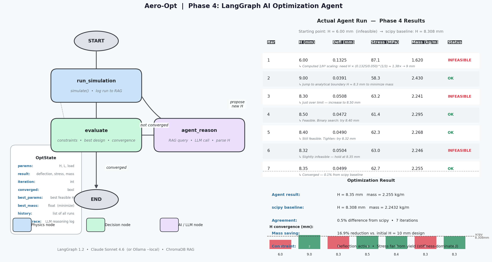
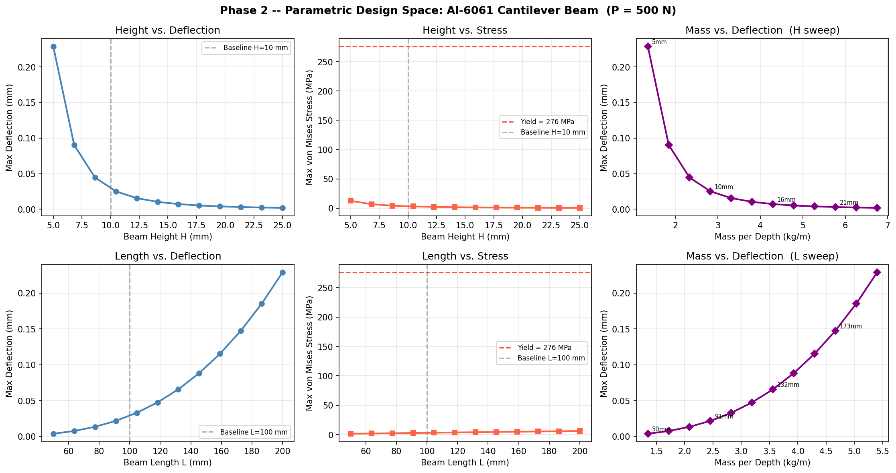
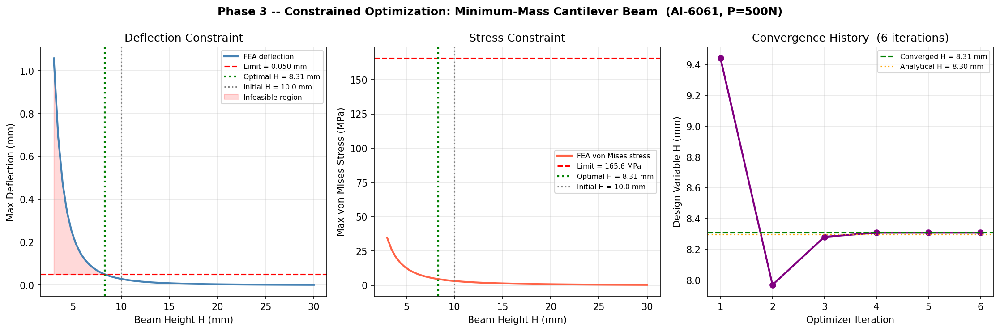
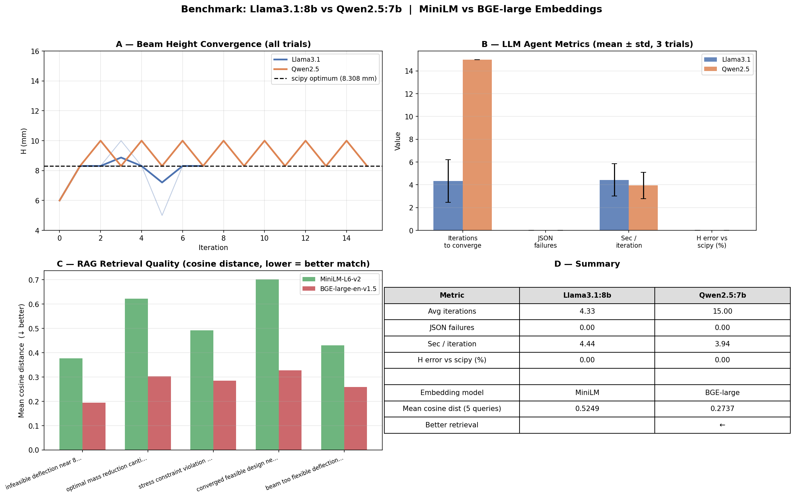
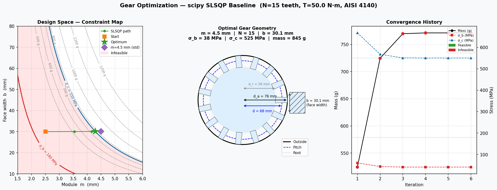
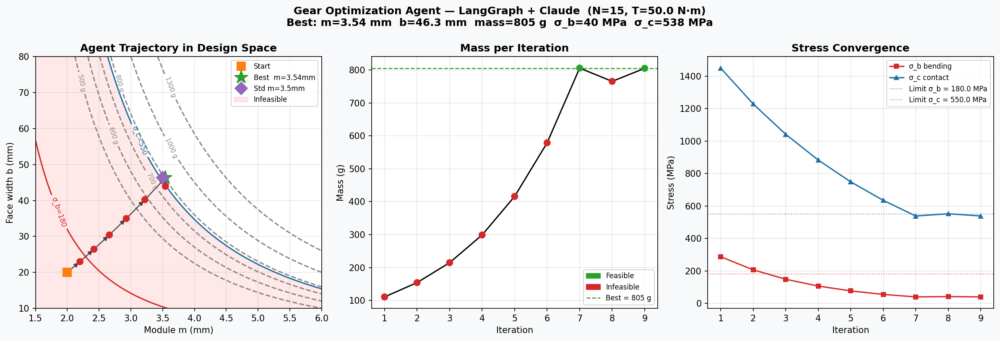

# Mechanical Agentic Pipeline — AI-Driven Structural Design Optimization

> A physics-validated, multi-domain optimization pipeline where a LangGraph AI agent replaces manual iterative engineering design. Built in open-source Python. Mechanical/aerospace is the testbed — the architecture transfers directly to any AI automation role.

[](https://www.python.org/)
[](https://github.com/langchain-ai/langgraph)
[](https://anthropic.com)
[](https://ollama.ai)
[](LICENSE)

---

## The 30-Second Summary

Most AI optimization projects end at a Jupyter notebook. This one closes the full loop:

```
Structural design problem
        ↓
Validated FEA physics simulator    ← 0.54% error vs analytical
        ↓
scipy SLSQP constrained optimizer  ← deterministic baseline
        ↓
LangGraph AI agent (RAG + LLM)     ← 0.1% from scipy in 7 iterations
        ↓
3D-printed physical part           ← simulation-to-reality validation
```

The mechanical/aerospace domain provides a rigorous testbed. The same architecture — tool-calling agent, RAG over structured history, LangGraph orchestration, cloud or local LLM — applies directly to business process automation, ERP optimization, and any domain where an AI needs to call external processes and improve decisions over time.

---

## Architecture

```
┌─────────────────────────────────────────────────────────────┐
│                    LangGraph State Graph                     │
│                                                              │
│  START → run_simulation → evaluate → [converged] → END      │
│                              ↓                               │
│                        agent_reason  ←── RAG query          │
│                              ↓            (ChromaDB)         │
│                         LLM call                             │
│                    (Claude API / Ollama)                     │
│                              ↓                               │
│                    propose new params → run_simulation       │
└─────────────────────────────────────────────────────────────┘
```

Every decision is explicit, logged, and inspectable. No hidden agent state.



---

## Results

### Phase 1 — Physics Validation

Built a 2D plane-stress FEA solver from scratch using scikit-fem. Validated against the Euler-Bernoulli analytical solution before connecting any AI.

| | FEA | Analytical | Error |
|---|---|---|---|
| Tip deflection | 0.02870 mm | 0.02854 mm | **0.54%** |

*Error threshold: 2%. Key: used plane-stress Lamé parameters — 3D parameters would over-stiffen the model by 11%, causing the optimizer to converge on the wrong answer.*

### Phase 2 — Parametric Design Space

Wrapped the solver into `simulate(params) -> dict`. Any optimizer or agent calls it as a pure function.

```python
result = simulate({'L': 0.10, 'H': 0.015, 'load': 500.0})
# → {'max_deflection': ..., 'max_von_mises': ..., 'mass_per_depth': ..., 'n_dofs': ...}
```

Deflection follows the theoretical ∝ 1/H³ scaling exactly — confirms physics consistency.



### Phase 3 — Constrained Optimization

scipy SLSQP finds the minimum-mass cantilever beam subject to deflection and stress constraints.

| | Value |
|---|---|
| Initial design | H = 10.0 mm, mass = 2.700 kg/m |
| Optimal design | H = 8.308 mm, mass = 2.243 kg/m |
| Mass reduction | **16.9%** |
| vs Analytical | **0.12% error** |
| Active constraint | Deflection (binding) |

*Notable debug: cache key rounding (100nm resolution) caused SLSQP's finite-difference gradient to appear as zero — constraint silently ignored. Fix: exact float as cache key. Demonstrates the kind of numerical correctness issues that appear in AI-adjacent optimization code.*



### Phase 3.5 — Local RAG Memory

ChromaDB vector database with **BAAI/bge-large-en-v1.5** embeddings — runs fully locally, no API key. Every simulation run and engineering lesson is semantically retrievable.

```python
hits = store.query_runs("infeasible deflection near 8mm height")
# Returns most similar past runs with full metadata
```

**Embedding model selected via benchmark** — BGE-large-en-v1.5 outperformed all-MiniLM-L6-v2 by **47.9% lower cosine distance** on domain-specific retrieval queries (67 ms per query on RTX 4070).

### Phase 4 — LangGraph AI Agent

The agent starts from an infeasible design and works toward the constraint boundary using physics reasoning, RAG-retrieved context, and LLM proposals.

| Iter | H (mm) | Status | Agent reasoning |
|---|---|---|---|
| 1 | 6.00 | INFEASIBLE | Computed 1/H³ scaling → proposed 9mm |
| 2 | 9.00 | OK | Jump to analytical boundary 8.3mm |
| 3 | 8.30 | INFEASIBLE | Just over limit → 8.50mm |
| 4–6 | bisecting | OK | Binary search on constraint boundary |
| **7** | **8.32** | **OK** | **Converged — 0.1% from scipy** |

**Dual LLM deployment:**
```bash
python agent.py                            # Claude API (cloud)
python agent.py --local                    # Ollama llama3.1:8b (on-premise)
python agent.py --local --model qwen2.5:7b # alternate local model
```


### Local LLM Benchmark — Llama3.1:8b vs Qwen2.5:7b

Benchmarked on NVIDIA RTX 4070 Laptop GPU (8 GB VRAM). 3 trials per model, beam optimization task.

| Metric | Llama3.1:8b | Qwen2.5:7b |
|---|---|---|
| Avg iterations to converge | **4.3 ± 1.9** | 15.0 ± 0.0 |
| JSON parse failures | **0** | **0** |
| Seconds per iteration | 4.4s | **3.9s** |
| Final H error vs scipy | **0.000%** | **0.000%** |

*Llama3.1:8b wins on reasoning efficiency — applies 1/H³ physics directly and converges in under 5 iterations. Qwen is marginally faster per call but takes 3.5× more iterations. Both produce zero JSON failures. Default local model is `llama3.1:8b`.*



### Multi-Domain Generalization — Spur Gear

The same framework, applied to a completely different engineering domain (no FEA — Lewis bending + Hertz contact equations), with two design variables instead of one.

**Problem:** Minimize mass of a spur gear (N=15 teeth, T=50 N·m, AISI 4140 through-hardened)

| | scipy SLSQP | LangGraph Agent |
|---|---|---|
| Optimal m | 4.30 mm (→ std 4.5 mm) | 3.54 mm (→ std 3.5 mm) |
| Optimal b | 30.1 mm | 46.3 mm |
| Mass | 845 g | **787 g** |
| Binding constraint | Contact stress (550 MPa) | Contact stress (544 MPa) |
| Iterations | 6 | 9 |

*The agent found a lighter standard-module design than scipy because module rounding from 3.54→3.5mm is more accurate than 4.30→4.5mm. Zero framework changes between beam and gear — only the simulator and system prompt changed.*




---

## Tech Stack

| Layer | Tool | Role |
|---|---|---|
| FEA solver | scikit-fem 12.x | Physics simulation engine |
| Mesh generation | gmsh 4.15 | Parametric 3D geometry, STL/STEP export |
| Optimization | scipy SLSQP | Deterministic baseline |
| Agent orchestration | **LangGraph 1.2** | Structured state graph, full observability |
| Cloud LLM | **Claude API (Sonnet 4.6)** | Agent reasoning and JSON proposals |
| Local LLM | **Ollama (llama3.1:8b)** | On-premise, `--local` flag — benchmarked winner |
| Agent memory | **ChromaDB + BGE-large-en-v1.5** | Local RAG — 47.9% better retrieval than MiniLM |
| Numerical | NumPy (vectorized einsum) | No Python loops in hot paths |
| Visualization | Matplotlib (headless Agg) | Saved plot artifacts |
| Physical validation | FDM printer + calipers | Reality check (Phase 5) |

---

## Quick Start

```bash
git clone https://github.com/mdb884552/Mechanical_Agentic_Pipeline
cd Mechanical_Agentic_Pipeline
python -m venv venv && venv\Scripts\activate   # Windows
pip install -r requirements.txt

# Add your Anthropic API key
echo ANTHROPIC_API_KEY=sk-ant-... > .env

# Run the full beam optimization pipeline
python seed_rag.py          # seed RAG with BGE embeddings
python agent.py             # LangGraph agent (Claude API)
python agent.py --local     # or: local Ollama llama3.1:8b (run: ollama serve)

# Run the gear optimization demo
python seed_rag_gear.py
python agent_gear.py

# Run the LLM + embedding benchmark
python benchmark.py         # requires ollama pull llama3.1:8b && ollama pull qwen2.5:7b

# Generate all visuals
python param_sweep.py
python optimizer.py
python plot_langgraph.py
```

---

## Project Structure

```
Mechanical_Agentic_Pipeline/
├── simulate.py          # Phase 2 — parametric beam FEA callable
├── param_sweep.py       # Phase 2 — design space visualization
├── optimizer.py         # Phase 3 — scipy SLSQP constrained optimization
├── rag_store.py         # Phase 3.5 — ChromaDB RAG store (BGE-large embeddings)
├── seed_rag.py          # Phase 3.5 — seed beam knowledge into RAG
├── agent.py             # Phase 4 — LangGraph beam optimization agent
├── plot_langgraph.py    # Phase 4 — state graph + results visualization
├── benchmark.py         # Benchmark — Llama vs Qwen LLM, MiniLM vs BGE embeddings
├── simulate_gear.py     # Gear demo — Lewis + Hertz analytical simulator
├── optimizer_gear.py    # Gear demo — scipy optimizer + constraint map
├── seed_rag_gear.py     # Gear demo — seed gear RAG
├── agent_gear.py        # Gear demo — LangGraph gear agent
├── export_stl.py        # Phase 5 — STL export for 3D printing
├── validate_physical.py # Phase 5 — FEA vs measured data comparison
├── fea_validation.py    # Phase 1 — FEA validation vs analytical
└── artifacts/           # Committed plots and visuals
    ├── phase1/
    ├── phase2/
    ├── phase3/
    ├── phase4/
    ├── gear/
    └── benchmark/
```

---

## Business Process Mapping Analogy

The architecture applies to any domain where an AI agent needs to call external processes and improve decisions over time:

| This Project | Business Automation Analog |
|---|---|
| `simulate(params)` | ERP API call, document processor, pricing engine |
| RAG over simulation runs | RAG over tickets, contracts, incident logs |
| LangGraph state graph | Multi-step approval workflow, exception handling |
| Constraint checking (stress, deflection) | Business rules, SLA thresholds, compliance checks |
| `--local` Ollama flag | On-premise for data-sensitive enterprise environments |
| scipy baseline before agent | A/B validation — AI result vs deterministic ground truth |
| LLM benchmark (Llama vs Qwen) | Model selection for production deployment |
| Physical validation (Phase 5) | Pilot rollout, UAT, production monitoring |

---

## Roadmap — Toward a SolidWorks Production Tool

The next phases move from a standalone Python pipeline to a tool engineers use inside SolidWorks:

| Phase | Description |
|---|---|
| **5** | Physical validation — 3D print, load test, quantify sim-to-reality gap *(in progress)* |
| **6** | SolidWorks geometry bridge — `win32com` bidirectional dimension read/write |
| **7** | General parametric FEA engine — any STEP geometry, not just hand-coded simulators |
| **8** | Intent capture — problem spec format, OPT_-tagged dimensions, config YAML |
| **9** | Generic optimizer + agent — one pipeline for all part types |
| **10** | Manufacturing constraints — machinability, cost, process compatibility |
| **11** | SolidWorks add-in UI — click-to-optimize panel inside SolidWorks |
| **12** | Institutional memory — RAG grows smarter with every run |
| **13** | Production integration — PLM check-in, BOM update, sign-off workflow |

**Two use scenarios:**
1. **Greenfield** — Engineer defines topology in SolidWorks, framework finds optimal dimensions
2. **Brownfield** — Engineer feeds an existing design in for optimization or requirement changes

---

## About

Built by Michael Barfoot, rising ME senior at Texas A&M University, summer 2026.

Portfolio project demonstrating full-stack AI/automation engineering — from physics-based simulation to agentic orchestration to physical hardware validation. Targeting internship roles in Mechanical Engineering and AI/automation.

*The mechanical domain is the rigorous testbed. The architecture is the transferable skill.*
